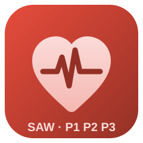
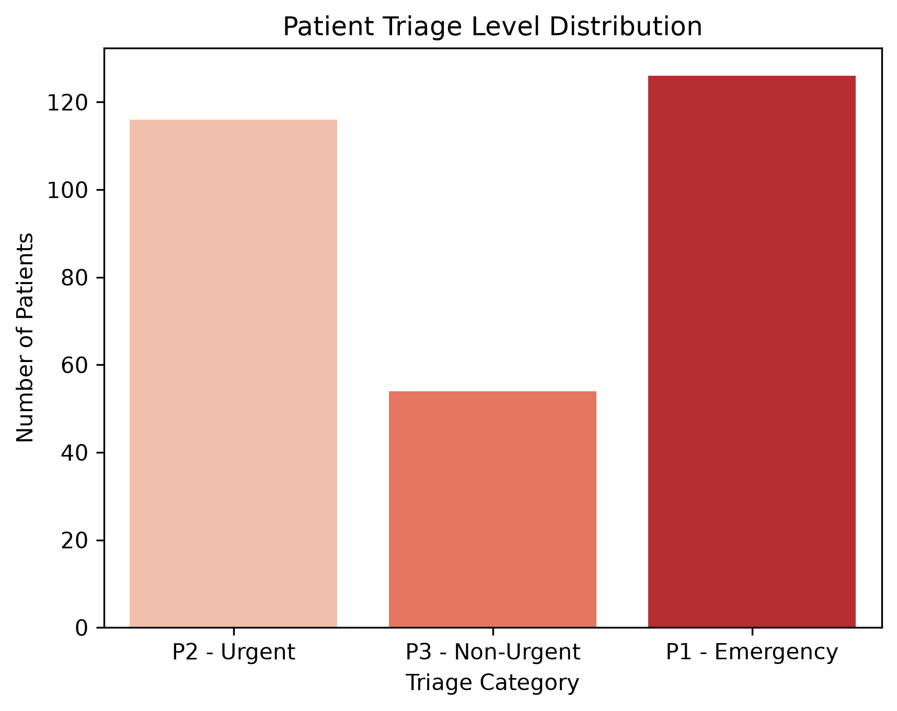
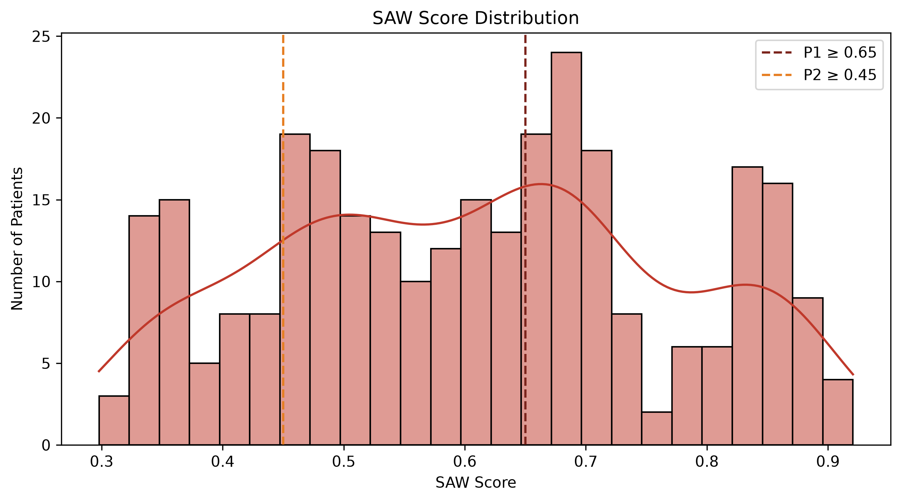
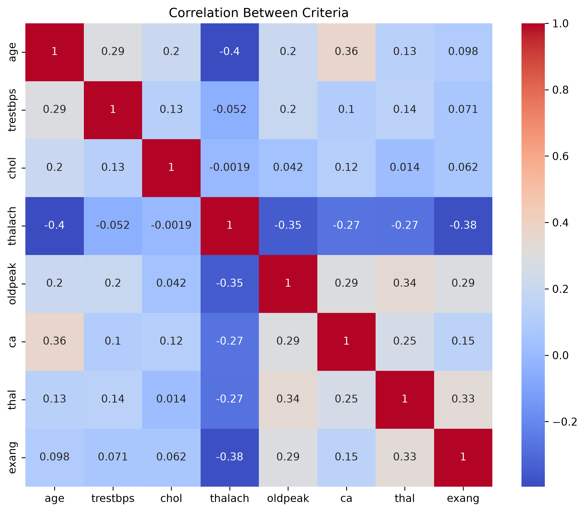

<div align="center">



# HeartTriage DSS

### Smart Triage, Faster Decisions

[](https://www.python.org/)
[](LICENSE)
[](CHANGELOG.md)
[](https://github.com/psf/black)
[](#testing)

[](docs/methodology.md)
[](docs/data_dictionary.md)
[](colab/HeartTriage_DSS_Colab.ipynb)

</div>

---

## Overview

**HeartTriage DSS** is a Decision Support System that assists emergency room
nurses and physicians in prioritizing cardiac patients. It computes an
objective, reproducible **risk score** for each patient from their clinical
profile and maps that score to a triage level with an explicit recommended
action — reducing reliance on subjective, experience-based judgment.

**Data being processed.** The system uses the [Cleveland Heart Disease
dataset](https://archive.ics.uci.edu/dataset/45/heart+disease) (`cleve.mod`),
comprising **303 patient records** with **13 clinical attributes** collected
during initial assessment: age, gender, chest pain type, resting blood
pressure, serum cholesterol, fasting blood sugar, resting ECG result, maximum
heart rate achieved, exercise-induced angina, ST depression (`oldpeak`), ST
slope, number of major vessels colored, and thalassemia type. Noise and
inconsistencies in the raw file (whitespace variations, `?` missing values in
`ca` and `thal`) are handled by the cleaning pipeline before scoring.

**Data being presented.** For every patient the system produces:

| Output                 | Description                                                                    |
| ---------------------- | ------------------------------------------------------------------------------ |
| **Risk score**         | SAW score in `[0, 1]` — weighted combination of 8 normalized clinical criteria |
| **Triage level**       | P1 Emergency (< 5 min) / P2 Urgent (< 30 min) / P3 Non-Urgent (< 60 min)       |
| **Recommended action** | Time-to-treatment target for the given triage level                            |
| **Reports & figures**  | CSV results, HTML report, distribution/correlation/profile charts              |

---

## Results at a Glance

When run on the full dataset (296 valid records), the pipeline distributes
patients across triage levels as follows:

| Triage | Category   | Count | Percentage |
| ------ | ---------- | ----: | ---------: |
| P1     | Emergency  |   126 |      42.6% |
| P2     | Urgent     |   116 |      39.2% |
| P3     | Non-Urgent |    54 |      18.2% |

**Triage level distribution** — how many patients fall into each priority band:

<div align="center">

</div>

**SAW score distribution** with triage thresholds (`P2 >= 0.45`, `P1 >= 0.65`):

<div align="center">

</div>

**Clinical feature correlation** among the eight scoring criteria:

<div align="center">

</div>

> The scoring thresholds are configurable in `src/config.py` and may be
> recalibrated following clinical validation.

---

## Key Features

- SAW engine — benefit/cost normalization and weighted scoring
- Triage classification with configurable P1/P2/P3 thresholds
- Cleaning pipeline that handles `?` missing values and mixed data types
- Visualizations — distribution, correlation, boxplot, histogram, radar charts
- Dual execution — local Python pipeline plus a self-contained Google Colab notebook
- Reporting — HTML report and an optional interactive Streamlit dashboard

---

## Quick Start

### Prerequisites

- Python 3.10+ and Git

### Installation (Local Mode)

```bash
# 1. Clone the repository
git clone https://github.com/bugkey24/hearttriage-dss.git
cd hearttriage-dss

# 2. Create and activate a virtual environment
python -m venv .venv
source .venv/bin/activate      # Linux / macOS
.venv\Scripts\activate         # Windows

# 3. Install dependencies
pip install -r requirements.txt

# 4. Run the full pipeline
python scripts/run_pipeline.py
```

### Google Colab Mode

Open the self-contained notebook — no repo clone or local setup required. All
charts are rendered directly inside the notebook output cells:

`colab/HeartTriage_DSS_Colab.ipynb`

See the [User Guide](docs/user_guide.md) for a comparison of both modes.

---

## Usage

```bash
# Full pipeline: load -> clean -> transform -> SAW -> triage
python scripts/run_pipeline.py

# Triage scoring summary only
python scripts/run_triage.py

# Generate HTML report
python scripts/generate_report.py

# Generate all figures (distribution, correlation, histogram, radar)
python scripts/make_figures.py

# Optional: interactive Streamlit dashboard
pip install .[dashboard]
streamlit run app.py

# Or use Make
make install    # install dependencies
make run        # run full pipeline
make figures    # generate figures
make test       # run test suite
```

Results are written to `data/processed/` and `outputs/`.

---

## How It Works

```
Patient clinical data (cleve.mod)
        |
        v
[1] Load & parse (whitespace-delimited mixed dataset)
        |
        v
[2] Clean (mark ? as missing, coerce numerics, drop invalid rows)
        |
        v
[3] Transform (symbolic attributes -> ordinal scores)
        |
        v
[4] SAW normalization (benefit/cost, values scaled to [0, 1])
        |
        v
[5] Weighted scoring (V_i = sum of w_j * r_ij, weights sum to 1.0)
        |
        v
[6] Triage categorization (P1 / P2 / P3) + recommendation
        |
        v
CSV results, HTML report, figures, dashboard
```

---

## Project Structure

```
hearttriage-dss/
├── README.md                     <- You are here
├── LICENSE                       MIT license
├── CHANGELOG.md                  Version history
├── CONTRIBUTING.md               Contribution guidelines
├── CODE_OF_CONDUCT.md            Code of conduct
├── requirements.txt              Python dependencies
├── environment.yml               Conda alternative
├── pyproject.toml                Packaging and tool configuration
├── Makefile                      Task automation
├── app.py                        Streamlit dashboard (optional)
│
├── data/
│   ├── raw/                      cleve.mod (raw dataset)
│   ├── interim/                  data after cleaning
│   └── processed/                clean data + triage results
│
├── notebooks/                    HT_01 ... HT_06 analysis notebooks
├── colab/                        Self-contained Colab notebook
│
├── src/                          Core package
│   ├── config.py                 Weights, thresholds, mappings
│   ├── data/                     loader, cleaner, transformer
│   ├── dss/                      saw engine, triage classifier
│   ├── visualization/            plot functions
│   └── utils/                    logger, helpers
│
├── scripts/                      run_pipeline, run_triage, generate_report, make_figures
├── outputs/                      figures, reports, logs (generated)
├── tests/                        pytest suite (29 tests)
├── docs/                         modular documentation
├── assets/                       logo and result images
├── templates/                    HTML report template
└── .github/                      CI workflow, issue/PR templates
```

---

## Documentation

Documentation is modularized — each topic lives in `docs/`:

| Document                                             | Content                                       |
| ---------------------------------------------------- | --------------------------------------------- |
| [`docs/index.md`](docs/index.md)                     | Documentation index and navigation            |
| [`docs/architecture.md`](docs/architecture.md)       | System architecture and data flow             |
| [`docs/methodology.md`](docs/methodology.md)         | SAW method, weights, and formulas             |
| [`docs/data_dictionary.md`](docs/data_dictionary.md) | Dataset attributes and mappings               |
| [`docs/user_guide.md`](docs/user_guide.md)           | How to run and use the system                 |
| [`docs/pipeline.md`](docs/pipeline.md)               | Data processing pipeline stages               |
| [`docs/roadmap.md`](docs/roadmap.md)                 | Development roadmap and status                |
| [`docs/glossary.md`](docs/glossary.md)               | Glossary of terms                             |
| [`docs/references.md`](docs/references.md)           | References and citations                      |
| [`docs/PROJECT.md`](docs/PROJECT.md)                 | Original project document (legacy, full spec) |

---

## Testing

```bash
pytest tests/ -v        # 29 tests: unit + end-to-end on the real dataset
```

---

## Roadmap

See [`docs/roadmap.md`](docs/roadmap.md) for the full development plan.

---

## Contributing

Contributions are welcome. Please read [`CONTRIBUTING.md`](CONTRIBUTING.md)
for the workflow, commit conventions, and coding standards.

---

## License

This project is licensed under the MIT License — see [`LICENSE`](LICENSE).

---

<div align="center">

Decision Support Systems course project - HeartTriage DSS

</div>
